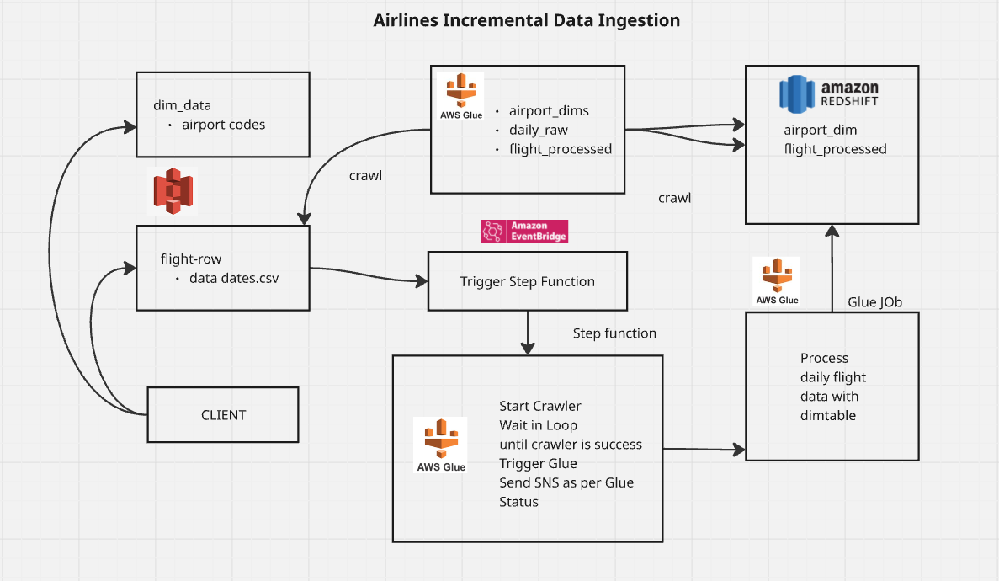

# Airline Incremental Data Ingestion

## Project Overview
This project implements an **incremental data ingestion pipeline** for airline flight data using AWS services. The pipeline automates the ingestion of raw CSV files from **S3**, transforms them via **AWS Glue**, catalogs the data, and loads it into **Redshift** for analytics.  

It is **event-driven**, triggered automatically when new files land in S3, ensuring **near real-time processing**, scalability, and fault tolerance.



---

## Components

### 1. **AWS S3**
- **Purpose**: Stores raw flight data CSV files and processed datasets.  
- **Why**: Acts as a scalable and durable storage layer for incremental ingestion.  
- **Usage in code**: EventBridge triggers on `"Object Created"` events in the `airlines` bucket.

### 2. **AWS Step Functions**
- **Purpose**: Orchestrates the pipeline workflow: starts the Glue Crawler, waits for completion, triggers Glue ETL job, and publishes notifications.  
- **Why**: Ensures sequential execution with error handling, retries, and monitoring.  
- **Workflow Steps**:
  1. Start the daily raw flights Glue Crawler (`daily_raw_flights_crawler`)
  2. Check Crawler status; wait if still running
  3. Trigger Glue ETL job (`airlines_incremental_data_processing_etl`)
  4. Notify via SNS on success or failure

### 3. **AWS Glue Job**
- **Purpose**: Transforms raw flight data and joins with airport dimension tables.  
- **Why**: Handles ETL logic for incremental ingestion, schema mapping, and loading into Redshift.  
- **Key steps from code**:
  - Read raw flight data from Glue Catalog (`flights_raw`)
  - Read airport codes dimension from Redshift via Glue Catalog (`dev_airlines_dim_airport_codes`)
  - Join for departure and arrival airport details
  - Apply schema mapping for output table
  - Write processed data to Redshift table (`daily_flights_processed`)

### 4. **AWS Glue Crawler & Glue Catalog**
- **Purpose**: Detects schema and updates Glue Catalog database `airlines`.  
- **Why**: Simplifies schema management and supports incremental ETL jobs.  
- **Example tables**:
  - `flights_raw` (raw S3 CSV data)
  - `dev_airlines_dim_airport_codes` (airport dimension)
  - `daily_flights_processed` (processed Redshift table)

### 5. **AWS Redshift**
- **Purpose**: Stores processed, incremental airline datasets for analytics.  
- **Why**: Provides fast SQL-based queries for reporting.  
- **Example schema**:
```sql
CREATE TABLE airlines.daily_flights_processed (
    carrier VARCHAR(10),
    dep_airport VARCHAR(200),
    arr_airport VARCHAR(200),
    dep_city VARCHAR(100),
    arr_city VARCHAR(100),
    dep_state VARCHAR(100),
    arr_state VARCHAR(100),
    dep_delay BIGINT,
    arr_delay BIGINT
);
